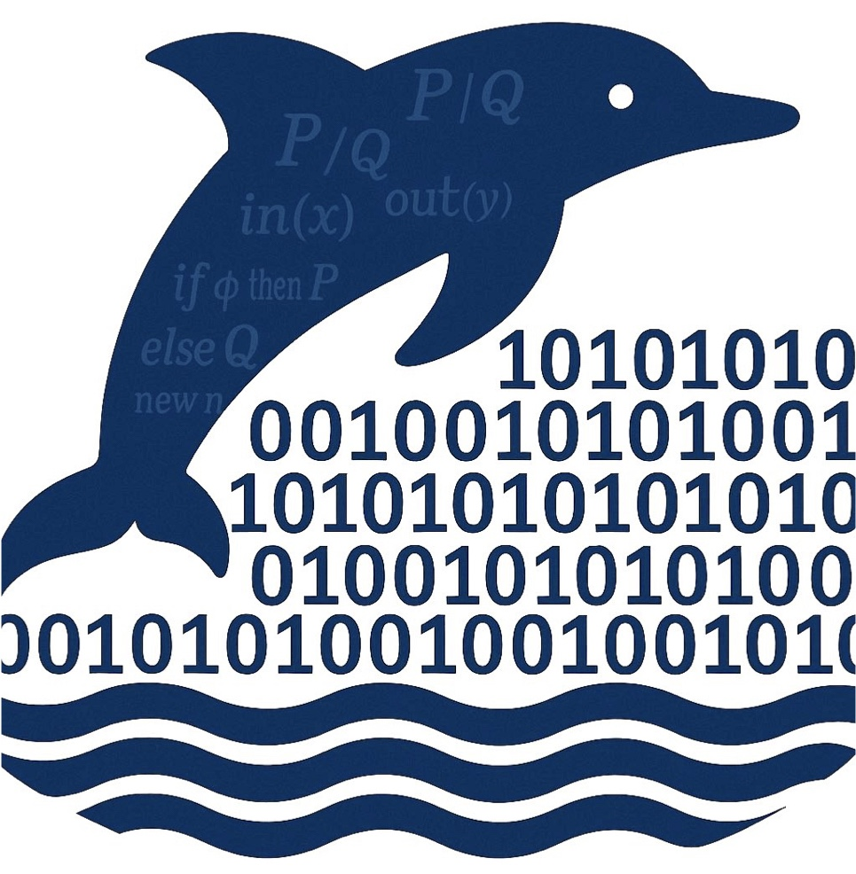

<h1 align="center">
  <picture>
    <source media="(prefers-color-scheme: dark)" srcset="CryptoBAP_Logo.png">
    <source media="(prefers-color-scheme: light)" srcset="CryptoBAP_Logo.png">
    
  </picture>
</h1>

<h2 align="center">CryptoBAP</h3>

<p align="center">
  A Binary Analysis Platform for Cryptographic Protocols
</p>

<p align="center">
  <a href="https://github.com/FaezehNasrabadi/CryptoBAP/issues">
    
  </a>
  
  <a href="LICENSE">
    
  </a>
</p>

---

## Automated Side-Channel Analysis of Cryptographic Protocols Implementations

This repository contains the implementation of CryptoBAP framework. It incorporates a diverse set of features. Here is a brief overview of the repository's contents:

- **Composition of Symbolic Labeled Transition Systems:**
    - Developing the composition of symbolic labeled transition systems, incorporating it with several deduction combiners to handle diverse scenarios, and showing the correctness of our symbolic composition. Refer to <a href="HolBA/src/tools/parallelcomposition/deduction">deduction</a> for the composition w.r.t. symbolic labeled transition's deduction relations, <a href="HolBA/src/tools/parallelcomposition/combinededuction">combinededuction</a> for the composition involving several combined deduction relations in addition to symbolic labeled transition's deduction relations, and <a href="HolBA/src/tools/parallelcomposition/generaldeduction">generaldeduction</a> for the composition containing a general combined deduction relation extra to symbolic labeled transition's deduction relations.

- **CSP-Style Parallel Composition:**
    - Enabling the parallel composition of concrete labeled transition systems using a CSP-style approach and proving theories surrounding it (see <a href="HolBA/src/tools/parallelcomposition/concrete">concrete</a>).

- **Refinement:**
    - Linking the analysis of symbolic system semantics to concrete system semantics using an additional theorem, set in <a href="HolBA/src/tools/parallelcomposition/refinement">refinement</a>.
   
- **Sapic Model:**

    - Formalizing the syntax and semantics of an applied pi-calculus model, <a href="HolBA/src/tools/parallelcomposition/sapic">Sapic</a>, which encompasses both the syntax and semantics of Dolev-Yao attacker and library models.    
    
- **Composition and Decomposition of Dolev-Yao Libraries:**

    - Establishing theorems for composing and decomposing Dolev-Yao libraries, located in <a href="HolBA/src/tools/parallelcomposition/DYLib">DYLib</a>. 
    
- **Framework Instantiation:**

    - Applying the framework to <a href="HolBA/src/theory/bir">BIR</a> (binary intermediate representation of ARMv8 and RISC-V machine code) and Sapic. In the <a href="HolBA/src/tools/parallelcomposition/instantiations">instantiations</a> folder, we demonstrate how the paper’s theorems combine to achieve an end-to-end correctness result. We have assigned specific files with descriptive names to their mechanized proofs in HOL4 for each trace equivalence and trace inclusion step we have proven.
    
- **Symbolic Execution:**

    - <a href="HolBA/src/tools/symbexec/examples/PreProcess">PreProcess</a> comprises source codes responsible for finding addresses of function calls, entry and exit points for loops of the BIR program before symbolic execution. <a href="HolBA/src/tools/symbexec/examples/libload">libload</a> encompasses the source codes of our symbolic execution, managing observations during the process, and <a href="HolBA/src/tools/symbexecbin">symbexecbin</a> includes the binary of the analyzed protocols and files needed to generate their BIR programs. 

- **Symbolic Execution Tree Translation:**

    - Demonstrating the translation of the symbolic execution tree of the BIR program into the Sapic model and proving this translation is correct, placed in <a href="HolBA/src/tools/parallelcomposition/translateTosapic">translateTosapic</a>.

- **Simplification rules combined with live variable analysis:**

    - Reducing model complexity with simplification rules applied at levels <a href="HolBA/src/tools/parallelcomposition/tree/sbir_treeLib.sml#L180">SBIR</a>, <a href="HolBA/src/tools/parallelcomposition/prettyPrint/sapic_to_fileLib.sml#L313">Sapic refinement</a>, and <a href="HolBA/src/tools/parallelcomposition/prettyPrint/sapic_to_fileLib.sml#L348">Sapic with live variable</a>.

- **Analysis Examples:**

	- Demonstrating the real-world applications of our methodology by analyzing the BAC protocol used in e-passports and WhatsApp, the world’s most widely used messaging application. The <a href="HolBA/src/tools/parallelcomposition/examples">examples</a> contain essential files for extracting the Sapic model of each component, along with the results from executing the model using ProVerif, Tamarin, and DeepSec tools.

		
### How to setup and compile


1. Establish the HolBA framework according to the guidelines provided in <a href="HolBA/README.md">HolBA-README.md</a>. There is no need to clone HolBA separately; a version that is compatible with our framework is available in our repository.

2. **(optional step)** To generate BIR programs for the analyzed protocol binaries, run `Holmake` in the <a href="HolBA/src/tools/symbexecbin">symbexecbin</a> directory. The BIR programs will be stored in ***\*Theory.sig*** files located in this directory. Alternatively, they will be created automatically the first time you execute an example.

3. Run the `make src/tools/parallelcomposition/examples/subdirectory/your-chosen-example.sml_run` command for your selected example while in the <a href="HolBA">HolBA</a> directory. The model you extract will be saved in the ***Sapic_Translation.txt*** file located in the relevant example subdirectory. Ensure you define the cryptographic primitives’ assumptions and security properties in the extracted model before assessing it with the Sapic toolchain. For comprehensive instructions on this process and to see the outcomes we received from the Sapic toolchain backends, consult <a href="HolBA/src/tools/parallelcomposition/examples/Results">Results</a>.


### Running example

The example is set for execution and demonstrates our core functionality using predefined inputs, files, and expected results. Now, we will clarify this example to help users create their own based on the supplied foundation. To this end, we will implement the Basic Access Control protocol as described in our paper.

1. Begin by putting the binary implementation file for the BAC protocol in the <a href="HolBA/src/tools/symbexecbin">symbexecbin</a> directory.

2. Lift either the entire binary file to a BIR program (use `read_disassembly_file_regions` function) or transpile specific code fragments to BIR (use `read_disassembly_file_regions_filter` function) by specifying code fragments as inputs in the <a href="HolBA/src/tools/symbexecbin/AliceScript.sml">script file</a> dedicated to the BAC protocol.

3. Specify the program-under-verification’s entry and exit addresses in the <a href="HolBA/src/tools/parallelcomposition/examples/BAC/Combination-BAC.sml">Combination-BAC</a> file, as outlined below:

    ```
    val lbl_tm = ``BL_Address (Imm64 240w)``;

    val stop_lbl_tms = [``BL_Address (Imm64 696w)``,``BL_Address (Imm64 536w)``,``BL_Address (Imm64 520w)``,``BL_Address (Imm64 528w)``,``BL_Address (Imm64 544w)``,``BL_Address (Imm64 548w)``];
    ```

4. Set the `obs_id` to the observation model you want to augment your BIR program with using the Scam-V observational models (which can be found <a href="HolBA/src/tools/scamv/obsmodel/bir_obs_modelLib.sml#L863">here</a>), set the value `full` to true if you want to obtain the complete Sapic model, otherwise, set it to false for the simplified Sapic model in the <a href="HolBA/src/tools/parallelcomposition/examples/BAC/Combination-BAC.sml">Combination-BAC</a> file.

5. Next, execute this command:

	- `make src/tools/parallelcomposition/examples/BAC/Combination-BAC.sml_run`

6. You can later access the extracted Sapic model in the ***Sapic_Translation.txt*** file within the <a href="HolBA/src/tools/parallelcomposition/examples/BAC">BAC</a> directory.

---

## License

CryptoBAP Core is licensed under the GNU Affero General Public License v3.0. Refer to the [LICENSE](LICENSE) file for more information.

The copyright holder offers alternative commercial licenses for organizations that wish to use CryptoBAP without AGPL obligations.

Contact: Faezeh Nasrabadi at <nasrabadi.faezeh@gmail.com>
